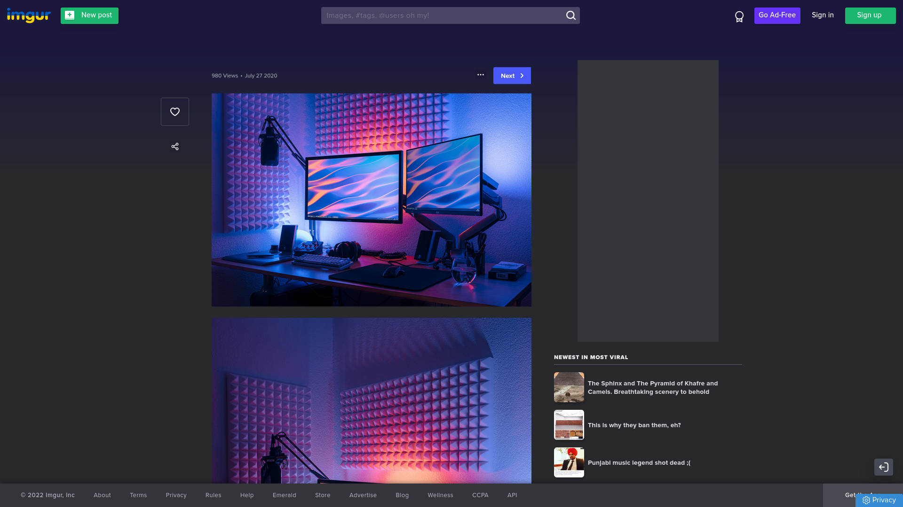
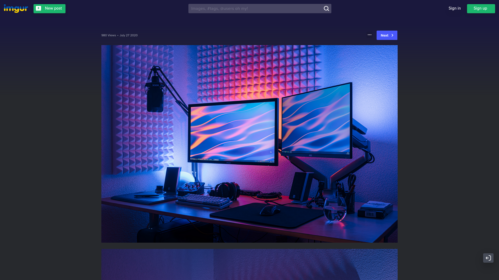

# imgur_without_distractions

Before:

After:

## How to use

Either:
- use the browser extension [Stylus](https://add0n.com/stylus.html)
- or use the [userChrome.css file with FireFox](https://www.howtogeek.com/334716/how-to-customize-firefoxs-user-interface-with-userchrome.css/)
